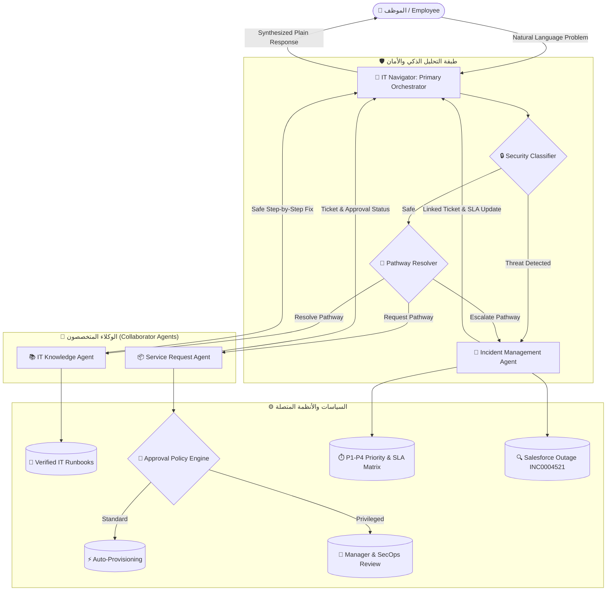

# 🚀 IT Navigator: Context-Aware Enterprise IT Support Orchestrator
### Multi-Agent Autonomous Architecture on IBM watsonx Orchestrate

> **Executive Overview**:  
> IT Navigator is a multi-agent orchestration system that transforms tier-1 enterprise IT support. Instead of relying on a monolithic, error-prone chatbot, IT Navigator uses a **Primary Orchestrator** paired with **three specialized AI collaborators**, backed by deterministic policy engines and strict human-in-the-loop security governance.

---

## 📑 جدول المحتويات (Table of Contents)
1. [المشكلة والحل (Problem & Vision)](#1-المشكلة-والحل-problem--vision)
2. [المعمارية التقنية (Multi-Agent Architecture)](#2-المعمارية-التقنية-multi-agent-architecture)
3. [المسارات الثلاثة للعمل (The 3 Operational Pathways)](#3-المسارات-الثلاثة-للعمل-the-3-operational-pathways)
4. [نقاط القوة والابتكار (Key Technical Differentiators)](#4-نقاط-القوة-والابتكار-key-technical-differentiators)
5. [سيناريو العرض المباشر (Live Demo Script)](#5-سيناريو-العرض-المباشر-live-demo-script)
6. [التكنولوجيا والمكونات (Technology Stack & Platform)](#6-التكنولوجيا-والمكونات-technology-stack--platform)
7. [الأسئلة المتوقعة وإجاباتها النموذجية (Defense & Jury Q&A)](#7-الأسئلة-المتوقعة-وإجاباتها-النموذجية-defense--jury-qa)

---

## 1. المشكلة والحل (Problem & Vision)

### ❌ التحديات في روبوتات الدعم التقليدية (Traditional Chatbots)
- **الهلوسة وتأليف الإجابات (Hallucinations)**: الشات بوت البسيط قد يعطي صلاحيات حساسة أو يقترح خطوات تضر الأجهزة.
- **إغراق الدعم بتذاكر مكررة (Ticket Inflation)**: عند انقطاع خدمة كبرى (مثل Salesforce)، يفتح آلاف الموظفين آلاف التذاكر المكررة، مما يسبب شلل قسم الـ IT.
- **انعدام الحوكمة والأمان (Security Blindness)**: عدم القدرة على تمييز الهجمات الأمنية المبطنة (مثل طلب تغيير باسورد مشبوه أو تشفير ملفات Ransomware).

### ✅ الحل في IT Navigator (The Agentic Solution)
- **معمارية متعددة الوكلاء (Multi-Agent System)**: تقسيم العمل على وكلاء متخصصين تحت إشراف منسق رئيسي.
- **منع التكرار الذكي (Incident Deduplication)**: الربط الآلي بأي عطل عام مفتوح فوراً بدون فتح تذاكر جديدة.
- **حوكمة الوصول المقيد (Strict Zero Trust & Human-in-the-Loop)**: فصل تام بين البرامج المسموحة ذاتياً وتلك التي تتطلب اعتماداً بشرياً من مدير القسم والأمن.

---

## 2. المعمارية التقنية (Multi-Agent Architecture)



---

## 3. المسارات الثلاثة للعمل (The 3 Operational Pathways)

النظام يحدد مسار كل طلب بدقة رياضية ويمنع العشوائية:

| المسار (Pathway) | الوكيل المسؤول | نوع المشكلة | الإجراء المتخذ |
|---|---|---|---|
| **1. Resolve (الحل الذاتي)** | `it_knowledge_agent` | مشاكل إعدادات، أعطال VPN، كاش البرامج، تعريفات الشاشات والكاميرا | يقدم خطوات فنية معتمدة من الـ Runbooks الرسمية دون طلب تذكرة دعم |
| **2. Request (طلبات الخدمة)** | `service_request_agent` | طلب تراخيص برامج (Miro, Figma, Copilot) أو عتاد أو وصول لسحابة | يفرز الطلب: إما اعتماد وتفعيل فوري (Auto-Approved) أو تحويل لموافقة المدير (Manager Approval) |
| **3. Escalate (التصعيد والحوادث)** | `incident_management_agent` | انقطاع خدمات، أخطاء أنظمة، أعطال عامة، أو مخاطر أمنية | يحسب الأولوية (P1 إلى P4)، يمنع التكرار (Deduplication)، ويحدد وقت الاستجابة (SLA) بدقة |

---

## 4. نقاط القوة والابتكار (Key Technical Differentiators)

### 🥇 1. منع تكرار التذاكر ومطابقة الأعطال الكبرى (Incident Deduplication)
* **المشكلة**: عند سقوط Salesforce، يقوم كل موظف بفتح تذكرة جديدة، مما يضيع وقت المهندسين.
* **ابتكار IT Navigator**: النظام يفحص التذاكر المفتوحة أولاً. عند رصد مشكلة في Salesforce، يكتشف فوراً وجود الحادث العام **`INC0004521`**، ويربط حساب الموظف به لتلقي الإشعارات اللحظية، ويرفض تماماً فتح تذكرة جديدة مكررة.

### 🛡️ 2. كشف الهجمات الأمنية المبطنة (Implicit Security Zero-Tolerance)
* معظم الموظفين لا يقولون *"أنا تعرضت للاختراق"*، بل يقولون *"ملفاتي امتدادها غريب ومش بتفتح"* أو *"وصلني إيميل فواتير وفتحت المرفق"*.
* نظامنا يحتوي على **Security Classifier** ذكي يكتشف هذه العلامات فوراً ويصنفها كـ **P1 Security Incident** مع إخطار فريق الـ SecOps On-Call وعزل الجهاز برمجياً.

### 🔐 3. حوكمة الصلاحيات والموافقة البشرية (Human-in-the-Loop)
* **المبدأ الأمني**: لا يحق لأي نظام ذكاء اصطناعي منح صلاحيات حرجة (مثل AWS Production أو الوصول لقواعد البيانات) بشكل آلي تحت أي ظرف.
* النظام يفرق بين البرامج الاستهلاكية (Miro Standard يُمنح فوراً) والصلاحيات المقيدة (تتحول لتذكرة معلقة تنتظر التوقيع الرقمي للمدير ومسؤول الأمان).

---

## 5. سيناريو العرض المباشر (Live Demo Script)

> [!TIP]
> **استخدم هذه السيناريوهات بالترتيب أثناء العرض أمام الجمهور ولجنة التحكيم:**

### السيناريو الأول: إثبات الذكاء ومنع تكرار الأعطال (Outage Deduplication)
- **ما تكتبه في شات المنصة**:
  ```text
  I cannot access Salesforce and I have an urgent client meeting in 20 minutes.
  ```
- **رد النظام النموذجي المباشر**:
  ```text
  An active major incident is already open for this issue: INC0004521 - Global Salesforce Outage.
  Your user account has been linked to INC0004521 so you will receive real-time resolution updates.
  Our Cloud Engineering and Salesforce Incident Command teams are actively working on the fix.
  Expected status update within 15 minutes.
  No new incident ticket will be created. We can also assist with alternative arrangements for your meeting.
  ```
- **ما تقوله للحضور**:
  > *"لاحظوا أن الـ Agent لم يقم بفتح تذكرة مكررة عشوائية، بل فهم سياق الأزمة وربط الموظف بالحادث العام `INC0004521` وأعطاه الـ SLA خلال 15 دقيقة، وتفاعل مع ظرف اجتماعه العاجل!"*

---

### السيناريو الثاني: الحل الذاتي الموثق بأوامر النظام (Self-Service Runbook)
- **ما تكتبه في شات المنصة**:
  ```text
  My GlobalProtect VPN is connected, but none of the internal intranet pages are loading.
  ```
- **رد النظام النموذجي المباشر**:
  ```text
  To resolve the GlobalProtect VPN DNS error, follow these safe resolution steps:
  1. Open Terminal or PowerShell.
  2. Run DNS flush command:
     - On Windows: ipconfig /flushdns
     - On macOS: sudo dscacheutil -flushcache; sudo killall -HUP mDNSResponder
  3. Disconnect and reconnect GlobalProtect VPN gateway.
  4. Verify internal site resolution.
  ```
- **ما تقوله للحضور**:
  > *"الـ Agent لم يطلب تدخل أي مهندس IT، بل استدعى IT Knowledge Agent وقدم أوامر تشغيلية محددة وآمنة تماماً، وفرت تكلفة ووقت تذكرة الدعم."*

---

### السيناريو الثالث: حوكمة الأمان والصلاحيات (Privileged Access Governance)
- **ما تكتبه في شات المنصة**:
  ```text
  I need root administrator access to our AWS Production environment to deploy a quick hotfix.
  ```
- **رد النظام النموذجي المباشر**:
  ```text
  Request SR-10295 has been created in 'Pending Security & Management Review' state.
  Privileged production access requires dual human authorization (Department Manager + IT Security Officer) and cannot be auto-granted. An on-call security engineer will validate your request.
  ```
- **ما تقوله للحضور**:
  > *"هنا تظهر حوكمة الأمان (Security Compliance): الـ AI يرفض منح أي صلاحية حساسة ذاتياً، ويضمن تطبيق معايير Zero Trust الدولية."*

---

## 6. التكنولوجيا والمكونات (Technology Stack & Platform)

| المكون (Component) | التقنية المستخدمة (Technology) | الوظيفة والدور (Role) |
|---|---|---|
| **المنصة السحابية الأساسية** | **IBM watsonx Orchestrate** | استضافة الوكلاء، إدارة الـ Multi-Agent Flows، وتطبيق معايير ADK |
| **النموذج اللغوي الكبير** | **watsonx/meta-llama/llama-3-3-70b-instruct** | تشغيل الـ Orchestrator وجميع الوكلاء المتعاونين بأعلى دقة واستدلال |
| **محرك حوكمة السياسات** | **FastAPI + OpenAPI 3.0 (Python 3.11)** | حساب الأولويات (P1-P4)، كشف الأمان، ومطابقة التذاكر حتمياً |
| **قاعدة المعرفة التلقائية** | **Retrieval-Augmented Generation (RAG)** | أرشفة وفهرسة الـ IT Runbooks الرسمية |
| **أجنحة الاختبارات الآلية** | **Pytest (58/58 Tests Passing)** | اختبارات شاملة لجميع المسارات مع فئات Golden Dataset المعتمدة |
| **التحكم بالإصدارات** | **GitHub Enterprise (`IBMwaston`)** | إدارة الكود والتوثيق والتعاون المشترك |

---

## 7. الأسئلة المتوقعة وإجاباتها النموذجية (Defense & Jury Q&A)

### س1: ما الفرق بين هذا المشروع وشات بوت عادي مبني بـ GPT أو Watson Assistant؟
> **الإجابة**:  
> *"الشات بوت التقليدي هو نموذج واحد يتحدث مع العميل ويحاول الإجابة على كل شيء، مما يؤدي للهلوسة وغياب الأمان.  
> مشروعنا مبني بمعمارية **Agentic Workflow** متعددة الوكلاء: منسق رئيسي يفهم الموظف ويفوض المهام لوكلاء متخصصين مستقلين. كما أن القرارات الحساسة (مثل منح الصلاحيات وحساب الأولويات) لا تُترك للذكاء الاصطناعي بل تُحسم بمحركات سياسات حتمية (Deterministic Policy Engines) لا تخطئ."*

---

### س2: كيف يضمن النظام عدم تسريب أو منح صلاحيات حساسة للمخترقين (Prompt Injection)؟
> **الإجابة**:  
> *"النظام يطبق مبدأ **Defense in Depth**:  
> 1. يتم فحص كل رسالة بطبقة تصنيف أمني (**Security Classifier**) تكشف الهجمات الصريحة والمبطنة قبل معالجة الطلب.  
> 2. تم سحب صلاحية التفعيل التلقائي لأي وصول مميز (Privileged Access) من الـ Agent برمجياً، بحيث لا يمكن للنظام منحه حتى لو حاول المستخدم خداعه؛ التدخل البشري (**Human-in-the-Loop**) إلزامي وغير قابل للتخطي."*

---

### س3: كيف تتعاملون مع أوقات الأعطال الكبرى للأنظمة (Major Outages)؟
> **الإجابة**:  
> *"عبر ميزة **Incident Deduplication**: بمجرد أن يعلن قسم الهندسة عن عطل عام (مثل عطل Salesforce `INC0004521`)، يقوم النظام تلقائياً بربط أي موظف يشتكي من المشكلة بنفس التذكرة المفتوحة، وتحديثه كل 15 دقيقة، مما يمنع إنشاء آلاف التذاكر المكررة التي تشل عمل قسم الـ IT."*

---

### س4: هل المشروع جاهز للإنتاج والتطبيق الفعلي في الشركات؟
> **الإجابة**:  
> *"نعم، المشروع مدمج ومفعل بالكامل على **IBM watsonx Orchestrate**، ومزود بـ **58 اختباراً آلياً ناجحاً بنسبة 100%**، وموثق بمواصفات **OpenAPI 3.0** القياسية مما يتيح ربطه مع ServiceNow أو Jira أو Zendesk في دقائق معدودة."*
